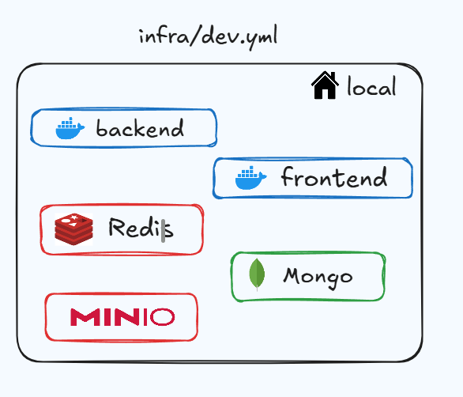
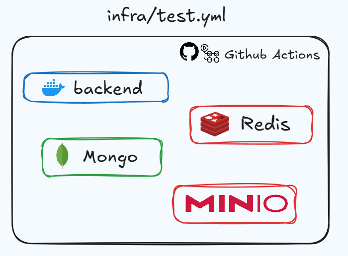
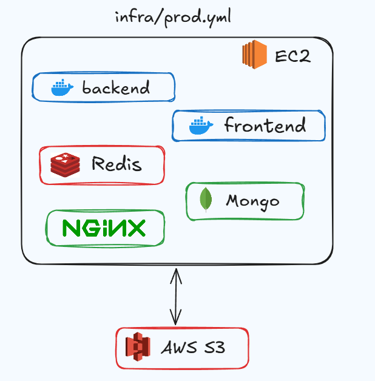
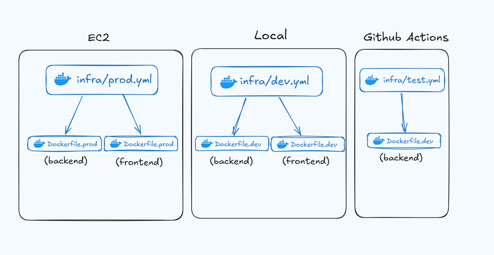
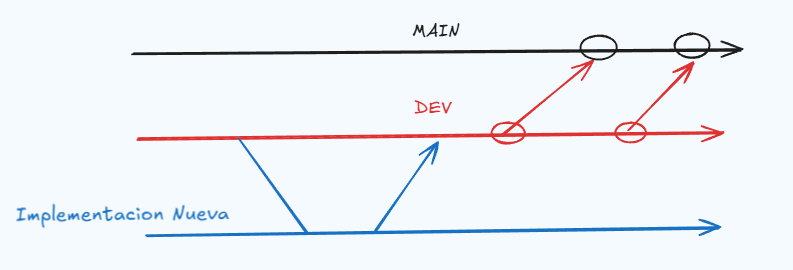
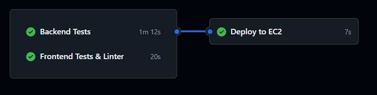
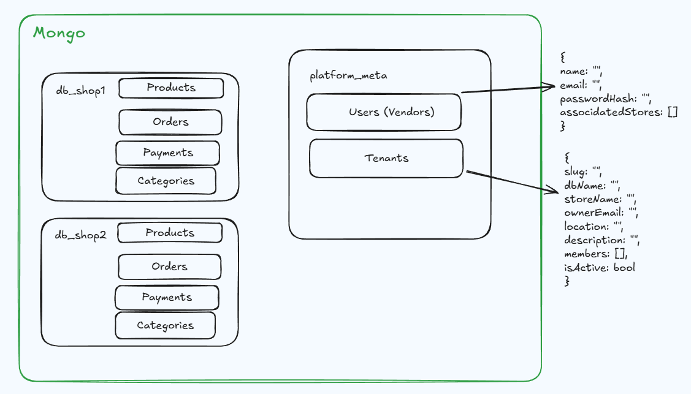
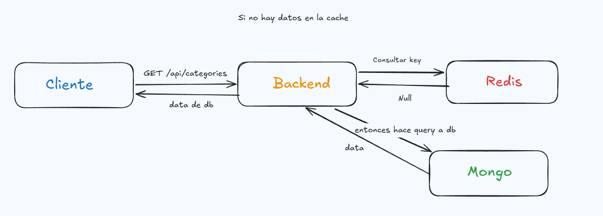
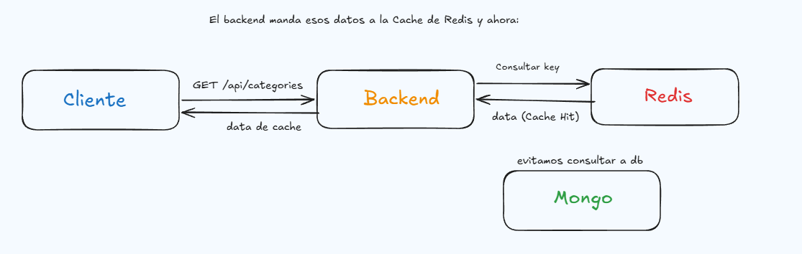
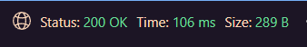

Integrantes:
- [Raphaël Nicaise](https://github.com/RaphaelNicaise) — Fullstack & Infrastructure
- [Nicolas Cordano](https://github.com/NACXIIX) — QA & Fullstack
- [Abner Grgurich](https://github.com/Abner2646) — Fullstack
- [Santiago Segal](https://github.com/Santucho12) — FullStack

[Trello](https://trello.com/b/Cl5Jz95t/trabajo-final-integrador) 

# Documentacion Tecnica - StoreHub

- [StoreHub](#storehub)
- [Stack](#stack)
- [Deploy](#deploy)
- [CI/CD](#cicd)
- [API](#api---documentacion-api)
- [MongoDB Multi-Tenant](#mongodb-multi-tenant)
- [Almacenamiento de Objetos (MinIO / S3)](#almacenamiento-de-objetos-minio--s3)
- [Redis - Cache](#redis---cache)
- [Backend](#backend)
- [Frontend](#frontend)
- [Testing](#testing)

## StoreHub

StoreHub es una plataforma **multi-tenant de comercio electrónico** que permite a cualquier emprendedor o negocio crear y administrar su propia tienda online desde un único sistema centralizado. Cada tienda opera de forma completamente independiente: tiene su propio catálogo de productos, categorías, órdenes, configuraciones y archivos, sin que exista ninguna interferencia con las demás tiendas del sistema.

### Qué problema resuelve

La mayoría de las soluciones de e-commerce obligan a los vendedores a adaptarse a plataformas genéricas o a costear infraestructura propia. StoreHub resuelve esto ofreciendo un entorno donde múltiples tiendas conviven en la misma infraestructura pero con datos completamente aislados, reduciendo costos operativos y simplificando la gestión para el administrador de la plataforma.

### Funcionalidades Principales

| Funcionalidad | Descripción |
|---------------|-------------|
| **Gestión de tiendas** | Creación, edición y eliminación de tiendas con slug único, logo y categoría |
| **Catálogo de productos** | CRUD de productos con imágenes, categorías, stock y sistema de promociones (porcentaje, monto fijo, NxM) |
| **Categorías** | Creación de categorías por tienda con generación automática de slug |
| **Órdenes** | Recepción de pedidos con validación de stock, seguimiento de estados (Pendiente, Confirmado, Enviado, Cancelado), cotización de envío por provincia y generación de comprobante PDF |
| **Configuraciones dinámicas** | Ajustes key-value por tienda para personalizar la experiencia pública (nombre, descripción, colores, etc.) |
| **Autenticación y roles** | Registro con confirmación por email, login JWT, recuperación de contraseña y sistema de invitaciones para agregar co-administradores a una tienda |
| **Almacenamiento de archivos** | Subida de imágenes de productos y logos a MinIO (desarrollo) o AWS S3 (producción), con carpetas aisladas por tienda |
| **Caché con Redis** | Capa de caché Cache-Aside sobre MongoDB con claves segmentadas por tenant para reducir latencia |
| **Notificaciones por email** | Emails transaccionales para confirmación de cuenta, nueva orden, confirmación de compra, reset de contraseña e invitaciones |
| **Panel de administración** | Dashboard con métricas, gestión de productos, órdenes, miembros y configuración de la tienda |

---

## Stack

[](https://skillicons.dev) & MinIO

---

## Deploy

La aplicacion se ejecuta enteramente en contenedores Docker. Cada entorno (desarrollo , test, produccion) tiene su propio archivo Docker Compose en la carpeta [`infra/`](infra/).
- Desarrollo: `infra/dev.yml` (MongoDB, Redis, MinIO, Backend, Frontend) -> se ejecuta en local


- Test: `infra/test.yml` (MongoDB, Redis, MinIO, contenedor de tests) -> se ejecuta en GitHub Actions para los tests del backend


- Produccion: `infra/prod.yml` (MongoDB, Redis, Backend, Frontend, Nginx) -> se ejecuta en una instancia EC2 en AWS



Ejecucion de los Dockerfiles:



### Variables de Entorno

La configuracion de cada entorno se gestiona mediante un archivo `.env` en la raiz del proyecto. A continuacion se detallan todas las variables necesarias, su uso por entorno y de donde se obtiene cada valor.

#### Desarrollo (`.env` local)

| Variable | Valor por defecto | Descripcion |
|----------|-------------------|-------------|
| `PORT` | `4000` | Puerto del backend |
| `INTERNAL_API_KEY` | Definir manualmente | Clave de API interna para proteger rutas |
| `REDIS_URL` | `redis://redis:6379` | Conexion al contenedor Redis |
| `MONGO_URI` | `mongodb://mongo:27017` | Conexion al contenedor MongoDB |
| `JWT_SECRET` | Definir manualmente | Secreto para firmar tokens JWT |
| `JWT_EXPIRES_IN` | `7d` | Duracion de los tokens JWT |
| `SMTP_HOST` | `smtp.gmail.com` | Host del servidor SMTP |
| `SMTP_PORT` | `465` | Puerto SMTP (SSL) |
| `MAIL_USER` | Credencial Gmail | Email emisor de correos |
| `MAIL_PASSWORD` | Credencial Gmail (App Password) | Contrasena de aplicacion del email |
| `MINIO_ENDPOINT` | `minio` | Hostname del contenedor MinIO |
| `MINIO_PORT` | `9000` | Puerto del API S3 de MinIO |
| `MINIO_ACCESS_KEY` | `minioadmin` | Usuario de MinIO |
| `MINIO_SECRET_KEY` | `minioadmin` | Contrasena de MinIO |
| `S3_INTERNAL_ENDPOINT` | `http://minio:9000` | Endpoint S3 interno (backend -> MinIO) |
| `S3_PUBLIC_ENDPOINT` | `http://127.0.0.1:9000` | Endpoint S3 publico (browser -> MinIO) |
| `NEXT_PUBLIC_API_URL` | `http://127.0.0.1:4000/api` | URL de la API visible por el frontend |
| `TEST_MP_PUBLIC_KEY` | *(opcional)* | Clave publica de MercadoPago test -- no implementado |
| `TEST_MP_ACCESS_TOKEN` | *(opcional)* | Access token de MercadoPago test -- no implementado |
| `AWS_REGION` | *(vacio)* | No necesario en desarrollo |
| `AWS_ACCESS_KEY_ID` | *(vacio)* | No necesario en desarrollo |
| `AWS_SECRET_ACCESS_KEY` | *(vacio)* | No necesario en desarrollo |

> Las variables de MercadoPago (`TEST_MP_*`) estan definidas en el template pero los pagos no estan implementados, por lo que no se utilizan.

#### Produccion (`.env` en EC2)

| Variable | Origen | Descripcion |
|----------|--------|-------------|
| `PORT` | Fijo: `4000` | Puerto del backend |
| `INTERNAL_API_KEY` | Generado manualmente | Clave de API interna |
| `REDIS_URL` | Fijo: `redis://redis:6379` | Redis en el mismo compose |
| `MONGO_URI` | Fijo: `mongodb://mongo:27017` | MongoDB en el mismo compose |
| `JWT_SECRET` | Generado manualmente | Secreto JWT (diferente al de dev) |
| `JWT_EXPIRES_IN` | `7d` | Duracion de tokens |
| `SMTP_HOST` | `smtp.gmail.com` | Servidor SMTP |
| `SMTP_PORT` | `465` | Puerto SMTP |
| `MAIL_USER` | Credencial Gmail | Email emisor |
| `MAIL_PASSWORD` | Credencial Gmail | App Password |
| `AWS_REGION` | Consola AWS (ej: `sa-east-1`) | Region del bucket S3 |
| `AWS_ACCESS_KEY_ID` | Consola AWS IAM | Credencial de acceso a S3 |
| `AWS_SECRET_ACCESS_KEY` | Consola AWS IAM | Credencial secreta de S3 |
| `S3_BUCKET_NAME` | Consola AWS S3 (ej: `storehub-uploads`) | Nombre del bucket en S3 |
| `S3_INTERNAL_ENDPOINT` | `https://{bucket}.s3.{region}.amazonaws.com` | Endpoint S3 (AWS) |
| `S3_PUBLIC_ENDPOINT` | `https://{bucket}.s3.{region}.amazonaws.com` | URL publica de imagenes |
| `NEXT_PUBLIC_API_URL` | `http://{IP_PUBLICA}/api` | URL de la API en produccion |
| `FRONTEND_URL` | `http://{IP_PUBLICA}` | URL del frontend (para CORS y emails) |

> En produccion no se usa MinIO. El `StorageService` detecta automaticamente si debe usar MinIO o S3 nativo de AWS segun la presencia de `S3_INTERNAL_ENDPOINT` en la configuracion del cliente S3 ([`s3.ts`](backend/src/config/s3.ts)).

### Dev

```bash
git clone https://github.com/RaphaelNicaise/Trabajo-Final-Integrador.git
```

Crear `.env` en base a [`.env.template`](.env.template) en el directorio raiz. Es necesario definir manualmente `JWT_SECRET` e `INTERNAL_API_KEY`; el resto de valores por defecto funcionan sin modificacion.

Para implementar cambios, crear una rama nueva a partir de `develop`:
```bash
git checkout develop
git checkout -b nombre-rama
```


Levantar contenedores en local:
```bash
docker compose -f infra/dev.yml --env-file .env up --build
```

Reiniciar contenedores y volumenes (limpia la base de datos):
```bash
docker compose -f infra/dev.yml --env-file .env down -v
docker compose -f infra/dev.yml --env-file .env up --build
```

### Prod

El deploy de produccion se ejecuta automaticamente mediante el pipeline de [CI/CD](#cicd) al mergear a `main`. Si se necesita hacer un deploy manual, los pasos son:

```bash
ssh -i clave.pem ubuntu@{IP_EC2}
cd /home/ubuntu/storehub
git pull origin main
docker compose -f infra/prod.yml --env-file .env up -d --build
docker image prune -f
```

La infraestructura de produccion ([`prod.yml`](infra/prod.yml)) levanta los siguientes servicios:

| Servicio | Imagen / Build | Puerto | Descripcion |
|----------|---------------|--------|-------------|
| `mongo` | `mongo:8` | 27017 | Base de datos MongoDB |
| `redis` | `redis:7-alpine` | 6379 | Cache en memoria |
| `backend` | `Dockerfile.prod` | 4000 | API Express (Node.js) |
| `frontend` | `Dockerfile.prod` | 3000 | Aplicacion Next.js |
| `nginx` | `nginx:alpine` | 80 | Reverse proxy |

---

## CI/CD

El pipeline de integracion continua y deploy se define en [`.github/workflows/main.yml`](.github/workflows/main.yml) y se ejecuta automaticamente en GitHub Actions ante cada push o pull request a las ramas `main` y `dev`.

### Diagrama del Pipeline



### Comportamiento por Rama

| Evento | Rama | Tests | Deploy |
|--------|------|-------|--------|
| Push / PR | `dev` | Se ejecutan | No se deploya |
| PR | `main` | Se ejecutan | No se deploya |
| Push (merge) | `main` | Se ejecutan | Si pasan, se deploya |

El deploy solo se ejecuta cuando el evento es un `push` directo a `main` (que ocurre al mergear un PR) y ambos jobs de tests pasan exitosamente. Esto garantiza que los pull requests validen el codigo sin triggerar un deploy.

### Etapas

#### 1. Backend Tests

Se ejecutan dentro de un entorno Dockerizado definido en [`infra/test.yml`](infra/test.yml), que levanta los servicios necesarios (MongoDB, Redis, MinIO) como contenedores aislados.

```bash
docker compose -f infra/test.yml --env-file .env up -d --build
```

El contenedor `api-tests` ejecuta `npx jest --runInBand --forceExit --verbose` contra la suite completa de tests del backend. El workflow espera a que el contenedor termine (`docker wait api-tests`) y verifica el codigo de salida.

**Servicios levantados en `test.yml`:**

| Servicio | Imagen | Proposito |
|----------|--------|-----------|
| `test_db` | `mongo:8` | MongoDB para tests |
| `test_minio` | `minio/minio` | Almacenamiento S3 para tests |
| `test_redis` | `redis:7-alpine` | Cache Redis para tests |
| `api-tests` | Build desde `Dockerfile.dev` | Ejecuta Jest |

#### 2. Frontend Tests y Linter

Se ejecutan directamente en el runner de GitHub Actions (sin Docker) con Node.js 20 y pnpm:

```bash
cd frontend && pnpm install
cd frontend && pnpm test --testPathPattern="__tests__/unit" --ci --runInBand
cd frontend && pnpm lint
```

#### Prod: 
- Para deployar a producción, se debe hacer un push a la rama main, y el pipeline de GitHub Actions se encargará de ejecutar los tests y, si todo pasa correctamente, hacer el deploy automático a la instancia EC2 configurada.
---

## CI/CD

El pipeline de integración continua y deploy se define en [`.github/workflows/main.yml`](.github/workflows/main.yml) y se ejecuta automáticamente en GitHub Actions ante cada push o pull request a las ramas `main` y `dev`.

### Filtro de Paths

El workflow **solo se dispara si al menos un archivo modificado pertenece a alguna de las siguientes rutas**. Cambios exclusivos en `docs/`, `README.md` u otros archivos no listados no ejecutan ningún job:

```yaml
paths:
  - 'backend/**'
  - 'frontend/**'
  - 'infra/**'
  - 'nginx/**'
  - 'e2e/**'
  - '.github/workflows/**'
```

Este filtro aplica tanto a eventos `push` como `pull_request` en ambas ramas (`main` y `dev`).

### Comportamiento por Rama

| Evento | Rama | Tests | Deploy |
|--------|------|-------|--------|
| Push / PR | `dev` | Se ejecutan | No se deploya |
| PR | `main` | Se ejecutan | No se deploya |
| Push (merge) | `main` | Se ejecutan | Si pasan, se deploya |

### Jobs

#### 1. Backend Tests

Levanta la infraestructura de tests con Docker Compose (`infra/test.yml`) y ejecuta Jest dentro del contenedor `api-tests`. El workflow espera a que el contenedor termine y verifica el código de salida.

#### 2. Frontend Tests & Linter

Instala dependencias con pnpm, ejecuta los tests unitarios del frontend y luego el linter de ESLint/Next.js.

#### 3. Deploy to EC2

Solo se ejecuta si la rama es `main`, el evento es `push` (no PR) y ambos jobs anteriores pasaron. Conecta via SSH a la instancia EC2 y ejecuta:

```bash
cd /home/ubuntu/storehub
git pull origin main
docker compose -f infra/prod.yml --env-file .env up -d --build
docker image prune -f
```

### Secrets de GitHub

Para que el pipeline funcione, se deben configurar los siguientes secrets en el repositorio:

| Secret | Uso | Etapa |
|--------|-----|-------|
| `INTERNAL_API_KEY` | API key para los tests del backend | Backend Tests |
| `MAIL_USER` | Email SMTP para tests | Backend Tests |
| `MAIL_PASSWORD` | Password SMTP para tests | Backend Tests |
| `AWS_HOST` | IP publica de la instancia EC2 | Deploy |
| `AWS_USER` | Usuario SSH (normalmente `ubuntu`) | Deploy |
| `AWS_SSH_KEY` | Clave privada `.pem` completa | Deploy |

---

## API -> [Documentacion API](docs/api.md)

Se puede importar la coleccion de Postman mediante este archivo: [Postman Collection](docs/TrabajoFinal.postman_collection.json)
- Crear un Entorno en Postman con la variable `host` y asignarle el valor `http://127.0.0.1:4000`

**Headers comunes:** Todos los endpoints fuera de `/api/auth` requieren el header `x-api-key` con la API key interna. Los endpoints multi-tenant requieren ademas `x-tenant-id` con el slug de la tienda, y los endpoints protegidos requieren `Authorization: Bearer <token>`.

---

## MongoDB Multi-Tenant

StoreHub implementa una arquitectura **Multi-Tenant** donde cada tienda tiene su propia base de datos MongoDB aislada, pero todas comparten la misma conexion fisica al cluster. La base de datos maestra `platform_meta` almacena la informacion global de usuarios y sus tiendas asociadas.

### Arquitectura



#### Conexion al Cluster - [`tenantConnection.ts`](backend/src/modules/database/tenantConnection.ts)
- **Conexion Unica**: Se establece una sola conexion fisica al cluster MongoDB usando `mongoose.createConnection()`
- **Pool de Conexiones**: Configurado con `maxPoolSize: 10` para optimizar rendimiento
- **Conexiones Logicas**: Cada base de datos (tenant) usa `useDb()` para crear conexiones logicas que comparten el mismo socket fisico

```typescript
const tenantDb = getTenantDB('db_test');
```

#### Factory de Modelos - [`modelFactory.ts`](backend/src/modules/database/modelFactory.ts)
- **Registro por Conexion**: Cada modelo (Product, Category, Order) se registra en la conexion especifica de su tenant
- **Cache de Modelos**: Evita re-compilar modelos si ya existen en esa conexion
- **Reutilizacion**: Un modelo puede existir en multiples conexiones sin conflictos

```typescript
const ProductModel = getModelByTenant(tenantConnection, 'Product', ProductSchema);
```

### Workflow

#### Identificacion del Tenant:
1. El cliente envia el header `x-tenant-id: test`
2. El middleware extrae el tenant ID
3. Se genera el nombre de la DB: `db_${tenantId}` -> `db_test`
4. Se obtiene la conexion logica a esa base de datos
5. Se opera sobre los modelos de esa conexion especifica

#### Ejemplo de Request:
```http
GET /api/products
Headers:
  x-tenant-id: test
  x-api-key: <api_key>
```

El backend:
1. Detecta `x-tenant-id = "test"`
2. Conecta a `db_test`
3. Consulta `db_test.products`
4. Retorna solo los productos de esa tienda

### Ventajas

- **Aislamiento Total**: Los datos de cada tienda estan completamente separados
- **Escalabilidad**: Agregar nuevas tiendas no requiere modificar codigo
- **Rendimiento**: Pool de conexiones compartido optimiza recursos
- **Seguridad**: Imposible que una tienda acceda a datos de otra
- **Simplicidad**: No requiere multiples instancias de MongoDB

### Base de Datos Maestra (`platform_meta`)

La base de datos `platform_meta` almacena:
- **Usuarios** ([`user.schema.ts`](backend/src/modules/platform/models/user.schema.ts)): Informacion de cuentas, credenciales, confirmacion de email, tokens de reset de contrasena
- **Tenants** ([`tenant.schema.ts`](backend/src/modules/platform/models/tenant.schema.ts)): Informacion de tiendas (slug, nombre, owner, miembros, categoria, imagen)
- **Invitaciones** ([`invitation.schema.ts`](backend/src/modules/platform/models/invitation.schema.ts)): Invitaciones pendientes para administrar tiendas

Cada usuario puede tener multiples tiendas asociadas:
```json
{
  "_id": "user123",
  "email": "user@example.com",
  "associatedStores": [
    {
      "tenantId": "db_test",
      "slug": "test",
      "storeName": "Mi Tienda",
      "role": "owner"
    }
  ]
}
```

---

## Almacenamiento de Objetos (MinIO / S3)

StoreHub utiliza **MinIO** en desarrollo y **AWS S3** en produccion como servicio de almacenamiento de objetos para gestionar imagenes de productos y logos de tiendas. Ambos servicios son compatibles con la API de S3, por lo que el mismo codigo del [`StorageService`](backend/src/modules/storage/services/storage.service.ts) funciona en ambos entornos.

### Uso

- Almacenar **imagenes de productos**
- Almacenar **logos de tiendas**
- En desarrollo se usa MinIO (contenedor local); en produccion se usa S3 nativo de AWS

La configuracion del cliente S3 ([`s3.ts`](backend/src/config/s3.ts)) detecta automaticamente el entorno: si existe `S3_INTERNAL_ENDPOINT`, conecta a MinIO con `forcePathStyle`; en produccion, usa el SDK de AWS con las credenciales IAM.

### Arquitectura Multi-Tenant

Al igual que MongoDB, el almacenamiento mantiene la arquitectura multi-tenant mediante carpetas aisladas por tienda:

```
platform-bucket/
├── shop1/
│   ├── logo.jpg
│   └── products/
│       ├── producto1.jpg
│       └── producto2.jpg
├── shop2/
│   └── products/
│       └── producto3.jpg
└── test/
    └── products/
        └── producto4.jpg
```

### Sincronizacion con Bases de Datos

Cada vez que se crea, actualiza o elimina un producto:
1. El backend identifica la tienda mediante `x-tenant-id`
2. Sube/elimina la imagen en la carpeta correspondiente: `{shopSlug}/products/`
3. Guarda la URL publica en la base de datos del tenant
4. El frontend accede directamente a la imagen mediante la URL

Cuando se elimina una tienda completa, se borran automaticamente:
- Base de datos MongoDB (`db_{shopSlug}`)
- Carpeta completa en el bucket (`{shopSlug}/`)

### Configuracion (solo desarrollo)

**Consola Web:** `http://localhost:9001`
**API S3:** `http://localhost:9000`

El bucket principal se inicializa automaticamente al levantar el backend en desarrollo. En produccion el bucket ya existe en AWS S3 y no se ejecuta la inicializacion.

---

## Redis - Cache

StoreHub integra **Redis** como capa de cache en memoria mediante el patron **Cache-Aside** para optimizar el rendimiento en los modulos de alta demanda. Al interceptar las consultas GET en la capa de servicios, se reduce la latencia de respuesta y la carga sobre MongoDB.

### Implementacion

La clase [`CacheService`](backend/src/modules/cache/services/cache.service.ts) actua como wrapper sobre el cliente Redis y expone tres metodos principales: `get<T>(key)`, `set(key, value, ttl)` y `delete(key)`. Si Redis no esta disponible, el servicio falla de forma graceful (logea un warning y continua sin cache).

La arquitectura respeta el diseno Multi-Tenant utilizando claves segmentadas por `shopSlug` para garantizar el aislamiento de datos entre tiendas. Ejemplo de claves:

| Modulo | Clave de cache | TTL |
|--------|---------------|-----|
| Productos (lista) | `tenant:{slug}:products:list` | 3600s |
| Productos (item) | `tenant:{slug}:products:item:{id}` | 3600s |
| Productos (publicos) | `tenant:{slug}:products:list:public` | 3600s |
| Categorias | `tenant:{slug}:categories` | 3600s |
| Configuraciones (admin) | `tenant:{slug}:configurations:admin` | 3600s |
| Configuraciones (publicas) | `tenant:{slug}:configurations:public` | 3600s |
| Tienda | `platform:shop:{slug}` | 3600s |
| Tiendas de usuario | `platform:user_shops:{userId}` | 3600s |

### Invalidacion

El sistema asegura la integridad de la informacion mediante una **invalidacion proactiva**: cada operacion de escritura (POST, PUT, DELETE) elimina las entradas de cache asociadas de forma automatica. Como respaldo adicional, todas las claves tienen un TTL de 1 hora que fuerza el refresco de los datos, garantizando consistencia final incluso si se modifica la base de datos manualmente.

### Servicios con Cache

- [Productos y Promociones](backend/src/modules/products/services/product.service.ts)
- [Categorias](backend/src/modules/categories/services/category.service.ts)
- [Configuraciones](backend/src/modules/configuration/services/configuration.service.ts)
- [Tiendas y Usuarios](backend/src/modules/shops/services/shop.service.ts)

### Flujo de Datos

**Sin datos en cache (Cache Miss):** El backend consulta la key en Redis, obtiene `null`, consulta a MongoDB, devuelve los datos al cliente y los almacena en Redis para futuras consultas.



**Con datos en cache (Cache Hit):** El backend consulta la key en Redis, obtiene los datos directamente y los devuelve al cliente sin consultar MongoDB.



### Prueba de Rendimiento

Primera consulta a `GET /api/categories` (Cache Miss -- consulta a la base de datos):



Segunda consulta a `GET /api/categories` (Cache Hit -- datos servidos desde Redis):


---

## Backend

El backend esta construido con **Express 5** sobre **Node.js 20** y **TypeScript**, organizado en modulos siguiendo una arquitectura modular. Cada modulo sigue el patron **MVC** (Model-View-Controller) adaptado para APIs REST.

### Dependencias Principales

| Paquete | Uso |
|---------|-----|
| `express` | Framework HTTP para la API REST |
| `mongoose` | ODM para MongoDB, gestiona modelos y conexiones multi-tenant |
| `redis` | Cliente Redis para la capa de cache |
| `@aws-sdk/client-s3` | Cliente S3 compatible con MinIO y AWS para almacenamiento de archivos |
| `jsonwebtoken` | Generacion y verificacion de tokens JWT para autenticacion |
| `bcryptjs` | Hashing de contrasenas |
| `nodemailer` | Envio de emails transaccionales (confirmacion de cuenta, ordenes, invitaciones) |
| `multer` | Middleware para manejo de uploads multipart/form-data |
| `pdfkit` | Generacion de comprobantes PDF de ordenes |
| `express-rate-limit` | Rate limiting global y por ruta |
| `rate-limit-redis` | Store de Redis para rate limiting distribuido |
| `mercadopago` | SDK de MercadoPago (preparado, pagos no implementados) |
| `cors` | Configuracion de Cross-Origin Resource Sharing |
| `uuid` | Generacion de nombres unicos para archivos subidos |
| `dotenv` | Carga de variables de entorno desde `.env` |
| `tsconfig-paths` | Resolucion de alias de path (`@/`) en desarrollo |
| `tsc-alias` | Resolucion de alias de path en el build de produccion |

### Estructura General

```
backend/src/
├── index.ts                 # Punto de entrada, inicializa Express y servicios
├── seed.ts                  # Script de seed de datos inicial
├── config/
│   ├── mail.ts              # Configuracion del transporter de Nodemailer
│   ├── mercadopago.ts       # Configuracion del cliente MercadoPago
│   ├── redis.ts             # Configuracion y exportacion del cliente Redis
│   └── s3.ts                # Configuracion del cliente S3 (MinIO / AWS)
├── middleware/
│   ├── apiKeyGuard.ts       # Validacion de API key en headers
│   ├── auth.middleware.ts    # Middleware de autenticacion JWT y extraccion de tenant
│   └── rateLimiter.ts       # Rate limiting global y por ruta con Redis store
├── types/
│   └── mercadopago.d.ts     # Declaraciones de tipos para MercadoPago
└── modules/
    ├── auth/                # Autenticacion y registro de usuarios
    ├── cache/               # Servicio de cache con Redis
    ├── categories/          # CRUD de categorias por tienda
    ├── configuration/       # Configuraciones key-value por tienda
    ├── database/            # Conexiones multi-tenant y factory de modelos
    ├── mail/                # Servicio de emails y templates HTML
    ├── orders/              # Gestion de ordenes, PDF y cotizacion de envio
    ├── payments/            # Integracion con MercadoPago (a implementar)
    ├── platform/            # Modelos globales (User, Tenant, Invitation)
    ├── products/            # CRUD de productos con imagenes y promociones
    ├── shops/               # Creacion, gestion de tiendas e invitaciones
    └── storage/             # Servicio de subida/eliminacion de archivos (S3)
```

### Modulos Implementados

#### auth/ - Autenticacion
- **Archivos**: [`auth.controller.ts`](backend/src/modules/auth/controllers/auth.controller.ts), [`auth.service.ts`](backend/src/modules/auth/services/auth.service.ts), [`auth.routes.ts`](backend/src/modules/auth/routes/auth.routes.ts)
- **Funcionalidad**: Registro de usuarios con confirmacion de email, login con JWT, recuperacion de contrasena con token temporal, confirmacion de cuenta
- **Dependencias**: `bcryptjs` para hashing, `jsonwebtoken` para tokens, `MailService` para envio de correos de confirmacion y reset

#### cache/ - Cache
- **Archivos**: [`cache.service.ts`](backend/src/modules/cache/services/cache.service.ts)
- **Funcionalidad**: Wrapper sobre el cliente Redis con metodos `get`, `set` y `delete`. Verifica disponibilidad de Redis antes de cada operacion y falla de forma graceful si no esta disponible

#### categories/ - Categorias
- **Archivos**: [`category.controller.ts`](backend/src/modules/categories/controllers/category.controller.ts), [`category.service.ts`](backend/src/modules/categories/services/category.service.ts), [`category.schema.ts`](backend/src/modules/categories/models/category.schema.ts), [`category.routes.ts`](backend/src/modules/categories/routes/category.routes.ts)
- **Funcionalidad**: CRUD de categorias con generacion automatica de slug. Al eliminar una categoria, se remueve de todos los productos que la referencien
- **Cache**: Invalidacion automatica al crear, actualizar o eliminar

#### configuration/ - Configuraciones
- **Archivos**: [`configuration.controller.ts`](backend/src/modules/configuration/controllers/configuration.controller.ts), [`configuration.service.ts`](backend/src/modules/configuration/services/configuration.service.ts), [`configuration.schema.ts`](backend/src/modules/configuration/models/configuration.schema.ts), [`configuration.routes.ts`](backend/src/modules/configuration/routes/configuration.routes.ts)
- **Funcionalidad**: Almacenamiento key-value por tienda para configuraciones dinamicas. Soporta upsert en batch, distincion entre configuraciones publicas y privadas (admin)
- **Cache**: Claves separadas para configs publicas y de admin

#### database/ - Conexiones Multi-Tenant
- **Archivos**: [`tenantConnection.ts`](backend/src/modules/database/tenantConnection.ts), [`modelFactory.ts`](backend/src/modules/database/modelFactory.ts)
- **Funcionalidad**: Gestiona la conexion unica al cluster MongoDB y crea conexiones logicas por tenant con `useDb()`. La factory de modelos registra y reutiliza modelos Mongoose por conexion

#### mail/ - Correos
- **Archivos**: [`mail.service.ts`](backend/src/modules/mail/services/mail.service.ts) y templates en [`templates/`](backend/src/modules/mail/templates/)
- **Funcionalidad**: Envio de correos transaccionales con templates HTML. Incluye templates para: confirmacion de cuenta, nueva orden (notificacion al vendedor), confirmacion de compra (notificacion al comprador), recuperacion de contrasena, invitacion a tienda

#### orders/ - Ordenes
- **Archivos**: [`order.controller.ts`](backend/src/modules/orders/controllers/order.controller.ts), [`order.service.ts`](backend/src/modules/orders/services/order.service.ts), [`order.schema.ts`](backend/src/modules/orders/models/order.schema.ts), [`order.routes.ts`](backend/src/modules/orders/routes/order.routes.ts)
- **Funcionalidad**: Creacion de ordenes con validacion de stock (descuenta automaticamente), actualizacion de estado (Pendiente, Confirmado, Enviado, Cancelado), generacion de comprobante PDF, cotizacion de envio simulada por provincia. Notifica por email al vendedor y al comprador al crear una orden

#### platform/ - Modelos Globales
- **Archivos**: [`user.schema.ts`](backend/src/modules/platform/models/user.schema.ts), [`tenant.schema.ts`](backend/src/modules/platform/models/tenant.schema.ts), [`invitation.schema.ts`](backend/src/modules/platform/models/invitation.schema.ts)
- **Funcionalidad**: Define los modelos de la base de datos maestra `platform_meta`. `User` almacena credenciales, estado de confirmacion y tiendas asociadas. `Tenant` almacena informacion de cada tienda y sus miembros. `Invitation` gestiona invitaciones para administrar tiendas

#### products/ - Productos
- **Archivos**: [`product.controller.ts`](backend/src/modules/products/controllers/product.controller.ts), [`product.service.ts`](backend/src/modules/products/services/product.service.ts), [`product.schema.ts`](backend/src/modules/products/models/product.schema.ts), [`product.routes.ts`](backend/src/modules/products/routes/product.routes.ts)
- **Funcionalidad**: CRUD de productos con soporte para imagenes (upload via multipart/form-data), categorias, y sistema de promociones (porcentaje, fijo, NxM). Cache granular por lista, item individual y lista publica
- **Integracion**: Usa `StorageService` para subir/eliminar imagenes en MinIO/S3

#### shops/ - Tiendas
- **Archivos**: [`shop.controller.ts`](backend/src/modules/shops/controllers/shop.controller.ts), [`shop.service.ts`](backend/src/modules/shops/services/shop.service.ts), [`shop.routes.ts`](backend/src/modules/shops/routes/shop.routes.ts)
- **Funcionalidad**: Creacion de tiendas (crea la DB tenant y asocia al usuario), edicion, eliminacion completa (borra DB + archivos en S3), upload de logo, gestion de miembros (invitacion por email, aceptacion, remocion). Es el modulo mas complejo del sistema (425 lineas de servicio)
- **Cache**: Invalida claves de tienda y de tiendas por usuario

#### storage/ - Almacenamiento
- **Archivos**: [`storage.service.ts`](backend/src/modules/storage/services/storage.service.ts)
- **Funcionalidad**: Servicio que abstrae la interaccion con S3 (MinIO o AWS). Metodos: `initializeMainBucket()` (solo dev), `uploadProductImage()`, `uploadLogoShop()`, `deleteFile()`, `deleteShopFolder()`
- **Compatibilidad**: El mismo codigo funciona con MinIO local y S3 en produccion

### Modulo Pendiente

#### payments/ - Pagos
- **Estado**: Estructura creada con `.gitkeep` en controllers, models y services. Existe una ruta basica en [`payments.ts`](backend/src/modules/payments/routes/payments.ts) que crea una preferencia de MercadoPago, pero no esta integrada al flujo de ordenes ni al frontend
- **A implementar**: Webhooks de MercadoPago, confirmacion de pagos, actualizacion automatica de estado de ordenes

---

## Frontend -> [Guia de Frontend](docs/docs.frontend.md)

### Dependencias Principales

| Paquete | Uso |
|---------|-----|
| `next` | Framework React con SSR, routing y optimizaciones de build |
| `react` / `react-dom` | Libreria UI base |
| `axios` | Cliente HTTP para consumir la API del backend |
| `@mui/material` | Componentes de UI (Material UI) |
| `@emotion/react` / `@emotion/styled` | Motor de estilos para Material UI |
| `tailwindcss` | Framework CSS utility-first para estilos rapidos |
| `framer-motion` | Animaciones y transiciones |
| `lucide-react` | Iconos SVG |
| `jsonwebtoken` | Decodificacion de tokens JWT en el cliente |
| `recharts` | Graficos y visualizaciones de datos |
| `xlsx` | Exportacion de datos a Excel |

---

## Testing

La estrategia de testing cubre backend y frontend con tests **unitarios** e **integracion**, ejecutados por **Jest** en ambos casos.

### Como Ejecutar los Tests

#### Backend

Los tests del backend requieren infraestructura (MongoDB, Redis, MinIO), por lo que se ejecutan dentro de Docker:

```bash
docker compose -f infra/test.yml --env-file .env up --build --exit-code-from api-tests
```

El archivo [`infra/test.yml`](infra/test.yml) levanta contenedores de MongoDB, Redis y MinIO, y ejecuta Jest dentro del contenedor `api-tests`. El archivo [`tests/setup.ts`](backend/tests/setup.ts) se encarga de conectar a MongoDB, Redis e inicializar el bucket de MinIO antes de todos los tests.

#### Frontend

Los tests del frontend no requieren infraestructura externa y se ejecutan directamente:

```bash
cd frontend
pnpm test --testPathPattern="__tests__/unit"
```

### Estructura de Tests

#### Backend - [`backend/tests/`](backend/tests/)

```
tests/
├── setup.ts                      # Inicializacion global (MongoDB, Redis, MinIO)
├── smoke.test.ts                 # Verifica que Jest funciona correctamente
├── integration/                  # Tests de integracion (HTTP real contra la API)
│   ├── auth.test.ts
│   ├── category.test.ts
│   ├── order.test.ts
│   ├── product.test.ts
│   └── shop.test.ts
└── unit/                         # Tests unitarios (logica de servicios con mocks)
    ├── auth.service.test.ts
    ├── category.service.test.ts
    ├── order.service.test.ts
    ├── product.service.test.ts
    ├── shop.service.test.ts
    └── mocks/                    # Mocks compartidos
```

#### Tests de Integracion (Backend)

Los tests de integracion hacen requests HTTP reales contra la aplicacion Express usando `supertest`. Se ejecutan contra una instancia real de MongoDB y Redis, lo que permite validar el flujo completo desde la ruta hasta la base de datos.

| Suite | Que valida |
|-------|-----------|
| [`auth.test.ts`](backend/tests/integration/auth.test.ts) | Registro de usuario, registro duplicado, login con credenciales incorrectas, login exitoso con usuario confirmado |
| [`category.test.ts`](backend/tests/integration/category.test.ts) | Creacion de categoria con autenticacion y API key, listado de categorias por tenant, eliminacion de categoria |
| [`product.test.ts`](backend/tests/integration/product.test.ts) | Creacion de producto con form-data, listado por tenant, aplicacion de promociones, actualizacion y eliminacion |
| [`order.test.ts`](backend/tests/integration/order.test.ts) | Creacion de orden con productos reales (valida stock), listado de ordenes, actualizacion de estado |
| [`shop.test.ts`](backend/tests/integration/shop.test.ts) | Creacion de tienda sin API key (debe fallar), sin token JWT (debe fallar), creacion exitosa, listado por usuario, eliminacion |

Cada suite utiliza un `tenantId` unico generado con `Date.now()` para evitar colisiones entre ejecuciones y garantizar aislamiento.

#### Tests Unitarios (Backend)

Los tests unitarios verifican la logica de los servicios de forma aislada, mockeando las dependencias externas (base de datos, cache, email, storage) con `jest.mock()`.

| Suite | Que valida |
|-------|-----------|
| [`auth.service.test.ts`](backend/tests/unit/auth.service.test.ts) | Registro con hashing de contrasena y envio de email de confirmacion, deteccion de email duplicado, login con validacion de credenciales y generacion de JWT |
| [`category.service.test.ts`](backend/tests/unit/category.service.test.ts) | Creacion de categoria con slug automatico e invalidacion de cache, listado usando cache (cache hit/miss), eliminacion con limpieza de referencias en productos |
| [`product.service.test.ts`](backend/tests/unit/product.service.test.ts) | CRUD completo con invalidacion de cache, listado con cache, obtencion por ID |
| [`order.service.test.ts`](backend/tests/unit/order.service.test.ts) | Creacion de orden con calculo de total y descuento de stock, validacion de producto inexistente, validacion de stock insuficiente, notificacion por email al crear orden |
| [`shop.service.test.ts`](backend/tests/unit/shop.service.test.ts) | Creacion de tienda con asociacion a usuario e invalidacion de cache, deteccion de slug duplicado |

#### Frontend - [`frontend/__tests__/`](frontend/__tests__/)

```
__tests__/
├── smoke.test.tsx                # Verifica que el entorno de testing de React funciona
└── unit/
    ├── contexts/
    │   └── cart.util.test.ts     # Funciones utilitarias del carrito
    └── services/
        ├── auth.service.test.ts
        ├── categories.service.test.ts
        ├── orders.service.test.ts
        ├── products.service.test.ts
        └── shops.service.test.ts
```

#### Tests Unitarios (Frontend)

Los tests del frontend mockean el modulo `axios` (via [`api.ts`](frontend/src/services/api.ts)) para verificar que cada servicio llama a los endpoints correctos con los parametros esperados, sin hacer requests HTTP reales.

| Suite | Que valida |
|-------|-----------|
| [`cart.util.test.ts`](frontend/__tests__/unit/contexts/cart.util.test.ts) | Funciones `calculateItemTotal` y `calculateUnitPrice`: calculo sin promocion, con descuento porcentual, fijo, NxM, promocion inactiva, y limites (total minimo 0) |
| [`auth.service.test.ts`](frontend/__tests__/unit/services/auth.service.test.ts) | Login (credenciales correctas, incorrectas, error de red), registro, confirmacion de cuenta, forgot/reset password, aceptacion de invitacion |
| [`categories.service.test.ts`](frontend/__tests__/unit/services/categories.service.test.ts) | CRUD completo contra los endpoints de categorias |
| [`orders.service.test.ts`](frontend/__tests__/unit/services/orders.service.test.ts) | Listado, obtencion por ID, creacion con header `x-tenant-id`, actualizacion de estado, cotizacion de envio, descarga de PDF |
| [`products.service.test.ts`](frontend/__tests__/unit/services/products.service.test.ts) | CRUD con FormData (multipart), listado publico, obtencion por ID con slug opcional, gestion de promociones (aplicar, eliminar, listar activas) |
| [`shops.service.test.ts`](frontend/__tests__/unit/services/shops.service.test.ts) | Listado de tiendas por usuario (con transformacion de campos), CRUD de tiendas, upload de logo con FormData, gestion de miembros (listar, agregar por email, eliminar) |

---

### Tests End-to-End (E2E)

Los tests E2E utilizan **Playwright** para automatizar un navegador real contra la aplicacion completa. A diferencia de los tests unitarios e de integracion, **no se ejecutan en el pipeline de CI/CD**: requieren que el entorno de desarrollo este corriendo localmente (`infra/dev.yml`).

> **Prerequisito**: tener el entorno de dev levantado antes de ejecutar los tests E2E.
> ```bash
> docker compose -f infra/dev.yml --env-file .env up --build
> ```

#### Herramientas

| Herramienta | Uso |
|-------------|-----|
| `@playwright/test` | Framework E2E: automatiza Chromium, Firefox y WebKit |
| `dotenv` | Carga `PLAYWRIGHT_BASE_URL` segun el entorno (por defecto `http://localhost:3000`) |
| `TypeScript` | Tipado estatico en la definicion de escenarios |

#### Estructura

```
e2e/
├── playwright.config.ts          # Configuracion central (browser, baseURL, reportes HTML)
├── package.json                  # Dependencias y scripts del modulo E2E
└── tests/
    ├── navegacion-busqueda-login.test.ts
    ├── pagina-principal.test.ts
    ├── flujo-completo.test.ts
    └── compra.test.ts
```

#### Suites Implementadas

| Suite | Que valida |
|-------|-----------|
| [`navegacion-busqueda-login.test.ts`](e2e/tests/navegacion-busqueda-login.test.ts) | Busqueda de tiendas por nombre, filtros por categoria, navegacion al login con verificacion de campos (email, contrasena, boton) |
| [`pagina-principal.test.ts`](e2e/tests/pagina-principal.test.ts) | Presencia del logo de StoreHub en `/`, navegacion a una tienda, incremento del contador del carrito flotante al agregar productos (1 -> 2 items) |
| [`flujo-completo.test.ts`](e2e/tests/flujo-completo.test.ts) | Click-through a tiendas disponibles, verificacion de que el heading principal coincida con el nombre real de la tienda |
| [`compra.test.ts`](e2e/tests/compra.test.ts) | Happy path completo de compra: agregar producto al carrito, ir al checkout, completar datos de identificacion, seleccion de provincia/ciudad, datos de envio y pago simulado, confirmacion final con estado "Orden Confirmada" |

#### Como Ejecutar

```bash
cd e2e
```

| Comando | Descripcion |
|---------|-------------|
| `npm run test` | Ejecuta todas las suites en modo headless. Genera reporte HTML en `/playwright-report` si hay fallos |
| `npm run test:ui` | Abre la UI interactiva de Playwright para depurar tests visualmente, ver trazas y DOM en tiempo real |

Para ver el reporte HTML despues de una ejecucion:

```bash
npx playwright show-report
```