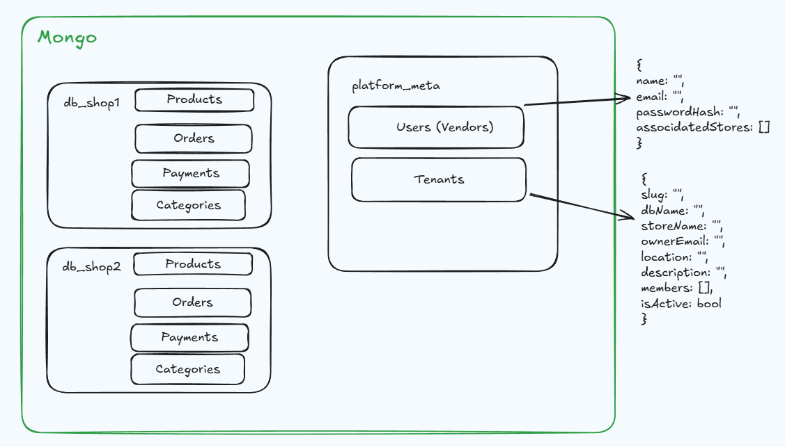

# Documentacion Tecnica StoreHub

- [Deploy](#deploy)
- [API](#api---documentacion-api)
- [MongoDB Multi-Tenant](#mongodb-multi-tenant)
- [Minio](#minio)

## Deploy
Levantar Proyecto:

Como se ejecutan los docker compose y los Dockerfile en [DEV](#dev) y [PROD](#prod)

#### Dev:

```bash
git clone https://github.com/RaphaelNicaise/Trabajo-Final-Integrador.git
```

En el caso de querer implementar cambios, se debe crear una rama nueva a partir de develop.
```
git checkout develop
git checkout -b nombre-rama
```


Levantar contenedores en local:
```bash
docker compose up --build
```

Reiniciar Contenedores y volumenes (db):
```bash
docker compose down -v
docker compose up --build
```

#### Prod: (todavia no)
---

## API -> [Documentacion API](api.md)
### Podes importar la coleccion de postman mediante este archivo: [Postman Collection](TrabajoFinal.postman_collection.json)
- Crear un Entorno en Postman con la variable `host` y asignarle el valor `http://127.0.0.1:4000`

---

## MongoDB Multi-Tenant

StoreHub implementa una arquitectura **Multi-Tenant** donde cada tienda tiene su propia base de datos MongoDB aislada, pero todas comparten la misma conexión física al clúster. Y la base de datos maestra `platform_meta` almacena la información global de usuarios y sus tiendas asociadas.

###  Arquitectura




####  **Conexión al Clúster** [`tenantConnection.ts`](../backend/src/modules/database/tenantConnection.ts)
- **Conexión Única**: Se establece una sola conexión física al clúster MongoDB usando `mongoose.createConnection()`
- **Pool de Conexiones**: Configurado con `maxPoolSize: 10` para optimizar rendimiento
- **Conexiones Lógicas**: Cada base de datos (tenant) usa `useDb()` para crear conexiones lógicas que comparten el mismo socket físico

```typescript
const tenantDb = getTenantDB('db_test');
```

####  **Factory de Modelos** [`tenantModelFactory.ts`](../backend/src/modules/database/modelFactory.ts)
- **Registro por Conexión**: Cada modelo (Product, Category, Order) se registra en la conexión específica de su tenant
- **Caché de Modelos**: Evita re-compilar modelos si ya existen en esa conexión
- **Reutilización**: Un modelo puede existir en múltiples conexiones sin conflictos

```typescript
const ProductModel = getModelByTenant(tenantConnection, 'Product', ProductSchema);
```

### Workflow

#### Identificación del Tenant:
1. El cliente envía el header `x-tenant-id: test`
2. El middleware extrae el tenant ID
3. Se genera el nombre de la DB: `db_${tenantId}` → `db_test`
4. Se obtiene la conexión lógica a esa base de datos
5. Se opera sobre los modelos de esa conexión específica

#### Ejemplo de Request:
```http
GET /api/products
Headers:
  x-tenant-id: test
```

El backend:
1. Detecta `x-tenant-id = "test"`
2. Conecta a `db_test`
3. Consulta `db_test.products`
4. Retorna solo los productos de esa tienda

### Ventajas

- **Aislamiento Total**: Los datos de cada tienda están completamente separados
- **Escalabilidad**: Fácil agregar nuevas tiendas sin modificar código
- **Rendimiento**: Pool de conexiones compartido optimiza recursos
- **Seguridad**: Imposible que una tienda acceda a datos de otra
- **Simplicidad**: No requiere múltiples instancias de MongoDB

### Base de Datos Maestra (`platform_meta`)

La base de datos `platform_meta` almacena:
- **Usuarios**: Información de usuarios registrados
- **Tiendas Asociadas**: Relación entre usuarios y sus tiendas

Cada usuario puede tener múltiples tiendas asociadas:
```json
{
  "_id": "user123",
  "email": "user@example.com",
  "associatedStores": [
    {
      "tenantId": "db_test",
      "slug": "test",
      "storeName": "Mi Tienda",
      "role": "owner"
    }
  ]
}
```

---

## Minio

StoreHub utiliza **MinIO** como servicio de almacenamiento de objetos compatible con AWS S3 para gestionar imágenes de productos y logos de tiendas.

### ¿Qué es MinIO?

MinIO es un servidor de almacenamiento de objetos de alto rendimiento compatible con la API de AWS S3. Lo usamos para:
- Almacenar **imágenes de productos**
- Almacenar **logos de tiendas**
- Mantener compatibilidad con S3 para migración futura a AWS

### Arquitectura Multi-Tenant

Al igual que MongoDB, MinIO mantiene la arquitectura multi-tenant mediante carpetas aisladas por tienda:

```
platform-bucket/
├── shop1/
│   ├── logo.jpg
│   └── products/
│       ├── producto1.jpg
│       └── producto2.jpg
├── shop2/
│   └── products/
│       └── producto3.jpg
└── test/
    └── products/
        └── producto4.jpg
```

### Sincronización con Bases de Datos

Cada vez que se crea, actualiza o elimina un producto:
1. El backend identifica la tienda mediante `x-tenant-id`
2. Sube/elimina la imagen en la carpeta correspondiente: `{shopSlug}/products/`
3. Guarda la URL pública en la base de datos del tenant
4. El frontend accede directamente a la imagen mediante la URL

**Ejemplo de flujo:**
- Se crea producto en tienda "test" → imagen se guarda en `test/products/uuid.jpg`
- URL pública: `http://localhost:9000/platform-bucket/test/products/uuid.jpg`
- MongoDB guarda la URL en `db_test.products`

Cuando se elimina una tienda completa, se borran automáticamente:
- Base de datos MongoDB (`db_{shopSlug}`)
- Carpeta completa en MinIO (`{shopSlug}/`)

### Configuración

**Consola Web:** `http://localhost:9001`  
**API S3:** `http://localhost:9000`

El bucket principal se inicializa automáticamente al levantar el backend con política pública de lectura para que las imágenes sean accesibles desde el navegador.