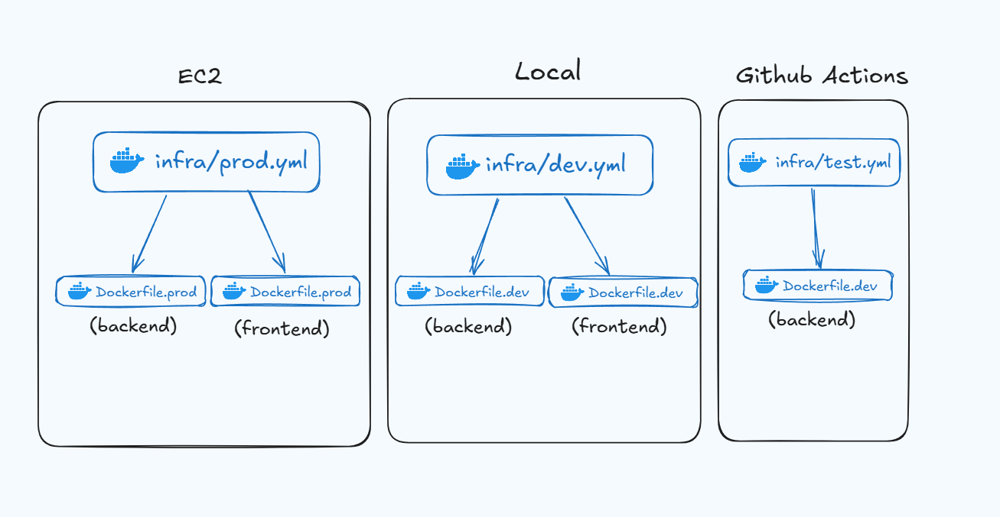
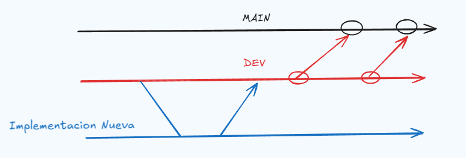

# Documentacion Tecnica StoreHub

- [Deploy](#deploy)
- [API](#api---documentacion-api)
- [MongoDB Multi-Tenant](#mongodb-multi-tenant)
- [Minio](#minio)

### Deploy
Levantar Proyecto:

Como se ejecutan los docker compose y los Dockerfile en [DEV](#dev) y [PROD](#prod)

#### Dev:

```bash
git clone https://github.com/RaphaelNicaise/Trabajo-Final-Integrador.git
```

En el caso de querer implementar cambios, se debe crear una rama nueva a partir de develop.
```
git checkout develop
git checkout -b nombre-rama
```



Levantar contenedores en local:
```bash
docker compose up --build
```

Reiniciar Contenedores y volumenes (db):
```bash
docker compose down -v
docker compose up --build
```

#### Prod:
---

### API -> [Documentacion API](api.md)

---

### MongoDB Multi-Tenant

Aquí tenés una versión más ordenada, estilizada y lista para meter directamente en una documentación técnica:

---

# 🗄️ **MongoDB Multi-Tenant — Arquitectura & Lazy Creation**

Guía técnica sobre cómo manejar múltiples tiendas (tenants) con bases de datos aisladas en MongoDB.

---

## 🔹 **1. Modelo Multi-DB por Tenant**

Cada tienda opera sobre **su propia base de datos** dentro del mismo clúster MongoDB.

### **Estructura**

* **Naming:** `db_{shopId}`
  *Ejemplo:* `db_shop1`, `db_123`
* **Aislamiento total:**
  No existe mezcla de datos entre tiendas.
* **Identificación del tenant:**
  Se obtiene desde el header HTTP:

  ```
  x-tenant-id: shopId
  ```

El backend direcciona dinámicamente con:

```js
mongoose.connection.useDb(`db_${tenantId}`);
```

---

## 🔹 **2. Lazy Creation (Creación Automática de DB y Colecciones)**

No existen scripts de "crear base de datos".
MongoDB **materializa** la base **solo cuando se utiliza por primera vez**.

### **Flujo de creación automática**

#### **1) Request entrante**

```
x-tenant-id: nueva_tienda
```

#### **2) Conexión lógica**

```js
const db = mongoose.connection.useDb('db_nueva_tienda');
```

#### **3) Materialización real**

* **Al escribir (POST / save()):**
  Mongo crea la base + colección + documento.
* **Al leer (GET):**
  Mongoose compila el modelo e intenta crear índices →
  Mongo crea la base + colección vacía.

---

## **Granularidad — Creación Independiente por Colección**

Cada colección se crea **solo cuando se usa**.

### **Ejemplo**

* Guardás una Categoría en tienda nueva:

  * Se crea `db_nueva_tienda`
  * Se crea **solo** la colección `categories`
* La colección `products` **NO** existe aún.

➡️ Aparecerá mágicamente **cuando guardes o leas un producto por primera vez**.

---

##  **3. Ventajas Clave**

### ✔ **Cero mantenimiento**

No es necesario registrar tiendas manualmente.

### ✔ **Escalabilidad instantánea**

La creación de bases y colecciones ocurre en milisegundos.

### ✔ **Eficiencia**

Tiendas inactivas no consumen espacio (solo metadatos mínimos).

---

Si querés también puedo armarte una versión para README, una diagramación con Mermaid, o incluir ejemplos de middleware.

---

### Minio