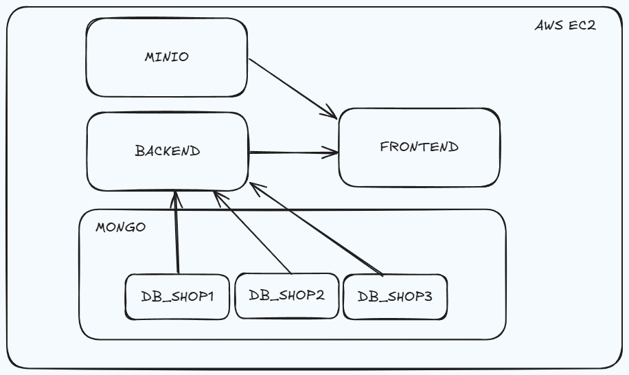

# `StoreHub`: Plataforma de tiendas

- [Idea general](#idea-general)
- [Tecnologías principales](#tecnologías-principales)
- [Funcionalidades del MVP](#funcionalidades-del-mvp)
- [Modelo de datos multi-tenant](#modelo-de-datos-multi-tenant)
- [Infraestructura](#infraestructura)
- [Gestión de secretos](#gestión-de-secretos)
- [CI/CD](#cicd)
- [Costos estimados](#costos-estimados)

---

## Idea general

La propuesta consiste en el desarrollo de una plataforma SaaS que permita a distintos vendedores crear y administrar su propia tienda en línea dentro de nuestro sistema.

Cada vendedor contará con:

- Un panel privado para gestionar productos, stock y pedidos.
- Una tienda pública bajo nuestra URL (ejemplo: `storehub.com/shop/shop_a`).
- Gestión básica de ventas (pedidos, estados, historial).
- Posibilidad de subir imágenes (almacenadas en S3).
- Un dashboard sencillo de métricas.

**Objetivo del MVP:** permitir crear una tienda, subir productos, ordenar productos de forma simple, procesar pagos con una pasarela (MercadoPago), comprar productos (usuario final).

---

## Tecnologías principales

- **Frontend:** React + Vite + Tailwind, servido con nginx en producción.
- **Backend:** Node.js + Express en TypeScript, con autenticación JWT y endpoints REST.
- **Base de datos:** MongoDB en modo multi-tenant, desplegado en la misma instancia EC2 que el backend.
- **Almacenamiento:** AWS S3 para imágenes (MinIO en desarrollo).
- **Contenedores:** Docker + docker-compose para empaquetar y levantar todo el sistema.
- **CI/CD:** GitHub Actions para testing y despliegue automático hacia AWS EC2.

---

## Funcionalidades del MVP

- Registro y login de vendedores.
- Creación de tiendas.
- CRUD de productos (nombre, descripción, precio, stock, imagen).
- Ordenar productos en la tienda pública.
- Renderizado de la tienda pública.
- Checkout funcional con pasarela de pagos en sandbox.
- Panel básico de pedidos.
- Subida de imágenes a almacenamiento externo (S3).
- Pipeline de despliegue automático en AWS.

**Quedan fuera (versión futura):**
- Funcionalides futurar a definir

---

## Modelo de datos multi-tenant

Cada tienda contará con su propia base de datos dentro de MongoDB (multi-DB). Además, habrá una base de metadatos (`platform_meta`) para mapear tiendas con sus respectivas bases.

**Ventajas:**
- Aislamiento lógico de datos por tienda.
- Escalabilidad progresiva.
- Posibilidad de ofrecer planes premium en el futuro.

---

## Infraestructura

**Arquitectura en producción (simplificada):**

⮕ Frontend (React servido por nginx)

⮕ Backend (Express en Docker)

⮕ Mongo (contenedor dentro de EC2, con varias DBs: shop_a, shop_b, ...)

⮕ MinioS3 (imágenes de productos) (s3 en producción)

- Todo el stack corre en EC2 con Docker Compose.
- MongoDB vive en el mismo servidor para simplificar costos y despliegue.
- Imágenes en S3 para no cargar el servidor con estáticos.

**En el prototipo:**
- Se usará IP pública de EC2 + HTTP (sin TLS).
- Se evita Route53, ACM y CloudFront para no añadir complejidad ni costos innecesarios.

---

## Gestión de secretos

- **GitHub Secrets:** credenciales necesarias para el pipeline CI/CD.
- **Variables de entorno en el servidor EC2:** configuración (URI de Mongo, claves de pago, etc.).

---

## CI/CD

Con GitHub Actions:

- Ejecución de pruebas (unitarias, integración, e2e) en cada push o PR.
- Deploy automático en EC2 al hacer push en `main`:
  - Conexión por SSH al servidor.
  - Pull de la rama principal.
  - Ejecución de `docker-compose up -d --build`.

Esto garantiza despliegues consistentes y controlados.

---

## Costos estimados

- **EC2 (t3.small o similar):** ~20–30 USD/mes.
- **S3:** unos pocos centavos por GB usado (para imágenes).
- **Route53 y ACM:** no se usarán en el prototipo, solo IP pública.
- **Mongo:** corre dentro de EC2, sin costos adicionales.

**Costo total esperado para la demo:** ~25–35 USD/mes.